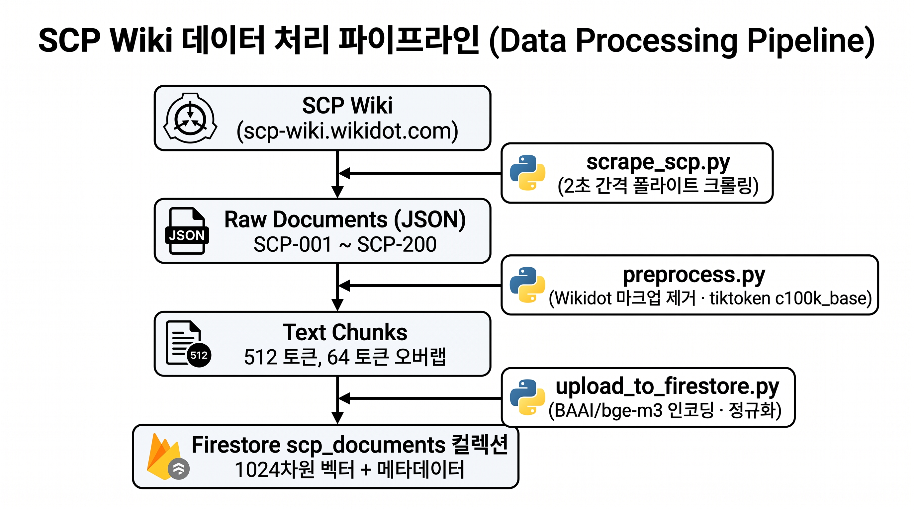

# SCP World

SCP Foundation 위키 콘텐츠를 RAG로 검색하고, 재단 페르소나(연구원/요원/SCP-079)로 답변하는 챗봇 데모.
100% 서버리스 (Cloud Run + Firebase Hosting + Firestore) 로 운영됩니다.

---

## Overview: 프로젝트 개요

### 기획 배경 및 목표

세계관을 탐구할 때, 단순히 위키를 읽는 것이 아니라 하나의 페르소나를 가진 캐릭터와 대화하며 알아가면 재밌을 것 같다고 생각했습니다. 방대한 자료와 오픈된 라이선스(CC BY-SA 3.0)를 가진 SCP 위키를 기반으로, 3가지 캐릭터를 통해 SCP 세계관에 대해 탐구할 수 있는 챗봇을 만들었습니다.

### 핵심 기능

| 기능 | 설명 |
|------|------|
| 페르소나 선택 | 연구원(Dr. [REDACTED]), 요원(Agent [REDACTED]), SCP-079(Old AI) 중 선택 |
| RAG 기반 대화 | SCP 위키 문서를 벡터 검색하여 근거 있는 답변 생성 |
| SSE 스트리밍 | 토큰 단위 실시간 스트리밍으로 자연스러운 대화 경험 |
| 페르소나별 격리 | 캐릭터마다 독립된 대화 세션 유지 |
| Google 로그인 | OAuth 2.0 기반 인증, ID Token으로 모든 API 보호 |
| 출처 표시 | 답변에 사용된 SCP 위키 원문 URL 제공 |

---

### 기술 스택

| 레이어 | 기술 |
|--------|------|
| Frontend | Flutter Web, Riverpod, go_router, Google Sign-In v7 |
| Backend API | FastAPI, Uvicorn, Python 3.11 |
| LLM Serving | vLLM (Qwen2.5-7B-Instruct), NVIDIA L4 GPU |
| Embedding | BAAI/bge-m3 (1024차원) |
| Vector DB | Firestore Native Vector Search (find_nearest, COSINE) |
| Infra | Cloud Run (Scale-to-Zero), Firebase Hosting, Firestore |
| Auth | Google OAuth 2.0, ID Token 검증 |

## 시스템 상세 설명
- **아키텍쳐**: [docs/architecture.md](docs/architecture.md)
- **배포**: [docs/deployment.md](docs/deployment.md)
- **프론트엔드**: [docs/frontend.md](docs/frontend.md)
- **화면구성도**: [docs/screens.md](docs/screens.md)
- **포트폴리오 설명**: [docs/PORTFOLIO.md](docs/PORTFOLIO.md)

---

## System Architecture

### 시스템 구성도

### 데이터 흐름도

**데이터 수집 파이프라인 (오프라인)**

**실시간 질의 파이프라인 (온라인)**

---

## 라이선스

- **소스 코드**: [MIT License](LICENSE)
- **SCP Foundation 콘텐츠**: [Creative Commons Attribution-ShareAlike 3.0](https://creativecommons.org/licenses/by-sa/3.0/) (CC-BY-SA 3.0). 출처: https://scp-wiki.wikidot.com/

두 라이선스는 서로 다른 대상에 적용됩니다. 본 저장소의 코드를 재사용할 때는 MIT, RAG로
제공되는 SCP 위키 텍스트를 재배포할 때는 CC-BY-SA 3.0 조건을 따라야 합니다.

## 안내
클로드 코드를 활용하여 작성되었습니다
